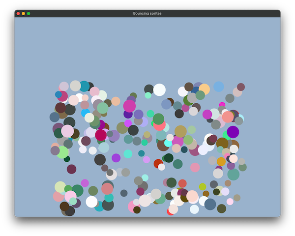
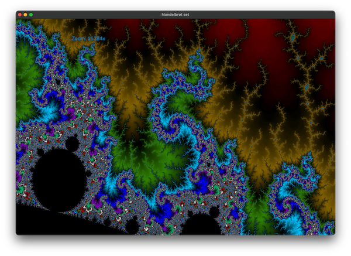

# flo_draw

This is a set of libraries that provide a 2D rendering framework for Rust. It provides on and off-screen rendering and
an abstraction API. You might want to read the [guide](draw/GUIDE.md) for some in-depth discussion of what can be achieved
with the libraries in this repository.

* `flo_draw` is a library that renders 2D graphics on-screen via glutin
* `flo_canvas` provides a way to describe 2D drawing operations without being tied to any particular rendering implementation
* `flo_render` is an abstraction API that converts low-level rendering instructions to a graphics API (OpenGL and Metal are supported)
* `flo_render_canvas` converts the instructions described in `flo_canvas` to instructions for `flo_render` (using lyon for the tessellation)
* `flo_render_gl_offscreen` helps `flo_render` by providing system-specific initialisation instructions for offscreen rendering

There are some other implementations of the `flo_canvas` protocol that are not yet packaged up conveniently: in particular,
`canvas.js` allows rendering to an HTML canvas, and FlowBetween contains implementations for Quartz and Cairo.

# Why use these crates?

The main reason to use `flo_draw` or the offscreen renderer in `flo_render_canvas` is that they provide a very straightforward API: the
setup needed to start drawing graphics to a window or a byte buffer is almost nonexistent. In spite of this they are also very flexible,
capable of being used to create fully interactive applications which can run on any system supported by glutin and OpenGL 3.3.

The rendering system is very flexible and easily ported to a different target, so if you outgrow the glutin-based windowing system and
want to integrate your algorithms into another application, the architecture supplied by `flo_canvas` and `flo_render` makes it easy to
intercept the underlying rendering operations and integrate them into any other system. Additional renderers are already available in
FlowBetween to render `flo_canvas` instructions to HTML canvases, OS X Quartz render contexts and to Cairo. `flo_render` has native support
for both OpenGL 3.3 and Metal.

The 2D graphics model used here has a few interesting features that are not present in many other rendering libraries. In particular, 
there is a layer system which is very useful for simplifying the design of interactive graphics applications by reducing the amount of
work involved in a redraw, and it's possible to both draw and erase shapes. With the hardware renderers in `flo_render`, the number of
layers is effectively unlimited. There's also a 'sprite' system, which makes it possible to easily re-render complicated shapes.

# Getting started

The `flo_draw` library is the best place to start, it provides a very easy way to render things on-screen:

```Rust
use flo_draw::*;
use flo_canvas::*;

pub fn main() {
    with_2d_graphics(|| {
        let canvas = create_canvas_window("Hello, triangle");

        canvas.draw(|gc| {
            gc.clear_canvas(Color::Rgba(0.0, 0.4, 0.4, 1.0));
            gc.canvas_height(1000.0);
            gc.center_region(0.0, 0.0, 1000.0, 1000.0);

            gc.new_path();
            gc.move_to(200.0, 200.0);
            gc.line_to(800.0, 200.0);
            gc.line_to(500.0, 800.0);
            gc.line_to(200.0, 200.0);

            gc.fill_color(Color::Rgba(0.0, 0.0, 0.8, 1.0));
            gc.fill();
        });
    });
}
```

# Examples

See the [examples](./draw/examples/) folder in the `draw` and `render_canvas` subdirectories for some more things that can be done with the library.



* [`cargo run --example canvas_window`](./draw/examples/canvas_window.rs) - displays a basic window
* [`cargo run --example hello_world`](./draw/examples/hello_world.rs) - traditional
* [`cargo run --example bounce_sprites`](./draw/examples/bounce_sprites.rs) - animates some bouncing balls
* [`cargo run --example follow_mouse`](./draw/examples/follow_mouse.rs) - demonstrates event handling by tracking the mouse around
* [`cargo run --example vectoroids`](./draw/examples/vectoroids.rs) - more involved example of event handling with an incomplete game (arrow keys to move, space to fire)
* [`cargo run --example png_triangle`](./draw/examples/png_triangle.rs) - renders a triangle to a png file
* [`cargo run --example mandelbrot`](./draw/examples/mandelbrot.rs) - an interactive mandelbrot set program
* [`cargo run --example wibble`](./draw/examples/wibble.rs) - render text to vectors and distort it in real time
* [`cargo run --example mascot`](./draw/examples/mascot.rs) - render FlowBetween's mascot from some pre-encoded vector instructions
* [`cargo run --example texture`](./draw/examples/texture.rs) - bitmap rendering
* [`cargo run --example texture_sprites`](./draw/examples/texture_sprites.rs) - bouncing balls with bitmap images
* [`cargo run --example gradient`](./draw/examples/gradient.rs) - gradient rendering
* [`cargo run --example mascot_shadow`](./draw/examples/mascot_shadow.rs) - reprocess the mascot rendering to add some extra shading
* [`cargo run --example wibble_mascot`](./draw/examples/wibble_mascot.rs) - reprocess the mascot rendering to make it wobble
* [`cargo run --example text_layout`](./draw/examples/text_layout.rs) - some effects that can be acheived with the text layout engine

 


# Companion crates

`flo_draw` was developed alongside several other crates, which may be of interest when developing software that uses the canvas:

* `flo_curves` provides a lot of functionality for manipulating bezier curves.
* `flo_stream` provides pubsub and generator streams, which are useful for distributing events around an application.
    (See the vectoroids example for a way to use a generator stream as a game clock)
* `desync` provides a simpler way to write asynchronous code than traditional threads
* `flo_binding` provides a way to convert between state changes and message streams, used in `flo_draw` to update the window configuration

# Version 0.3

This is version 0.3 of `flo_draw`.


